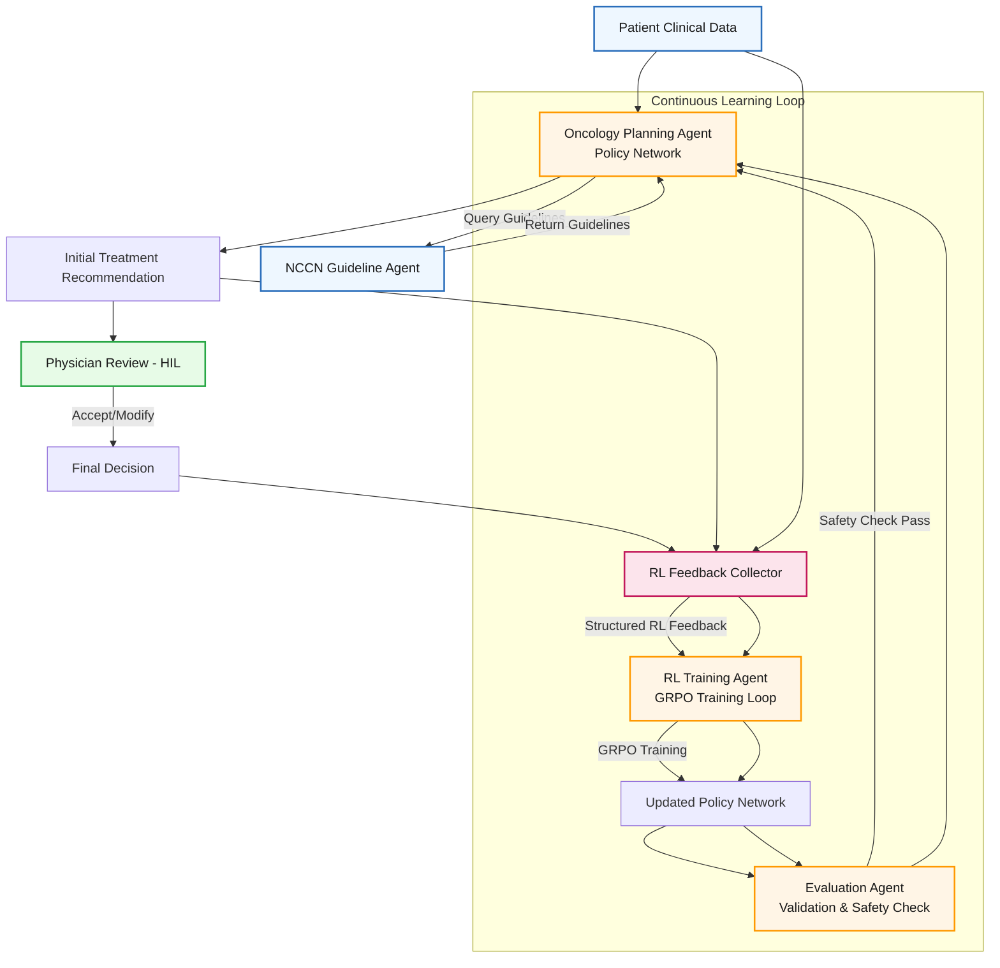

# probill


```mermaid
flowchart LR
    %% Define styles
    classDef orchestrator fill:#fef6e4,stroke:#b84f0c,stroke-width:1px,color:#612e02
    classDef ledger fill:#fde6e4,stroke:#b84f0c,stroke-width:1px,color:#612e02,stroke-dasharray: 5
    classDef agent fill:#e6f7ff,stroke:#2b5ea8,stroke-width:1px,color:#0b2a49
    
    %% Nodes
    T((Task)):::ledger --> O{Orchestrator\\(MDT Chair)}:::orchestrator
    O ---> TL[Task Ledger\\- Facts to look up\\- Plans & derivations]:::ledger
    O ---> PL[Progress Ledger\\- Progress checks\\- Next speaker\\- Completion?]:::ledger

    subgraph Agents
      AR[Ai Radiology Agent\\(FileSurfer/WebSurfer)]:::agent
      AP[Ai Pathology Agent\\(FileSurfer/WebSurfer)]:::agent
      AO[Ai Oncology Planning\\(RL + guidelines)]:::agent
      AB[Ai Billing Agent\\(Insurance checks)]:::agent
      AK[NCCN Knowledge Agent]:::agent
    end

    %% Flows
    O --> AR
    O --> AP
    O --> AK
    O --> AO
    O --> AB

    AR --> O
    AP --> O
    AK --> O
    AO --> O
    AB --> O

    %% Decision Structures
    O --> DC1{Progress being made?}
    DC1 -- No --> ST{Stall count\\> 2?}
    ST -- Yes --> RL(Revise Plan in\\Task Ledger)
    ST -- No --> DC1
    DC1 -- Yes --> DC2{Task Complete?}
    DC2 -- No --> O
    DC2 -- Yes --> Done([\"Task Complete\\nFinal Plan\"])

    RL --> O

    %% Classes
    class T ledger
    class O orchestrator
    class TL ledger
    class PL ledger
    class Agents agent

    %% Layout adjustments
    %% (You can tweak spacing/positions in a Mermaid editor)
```